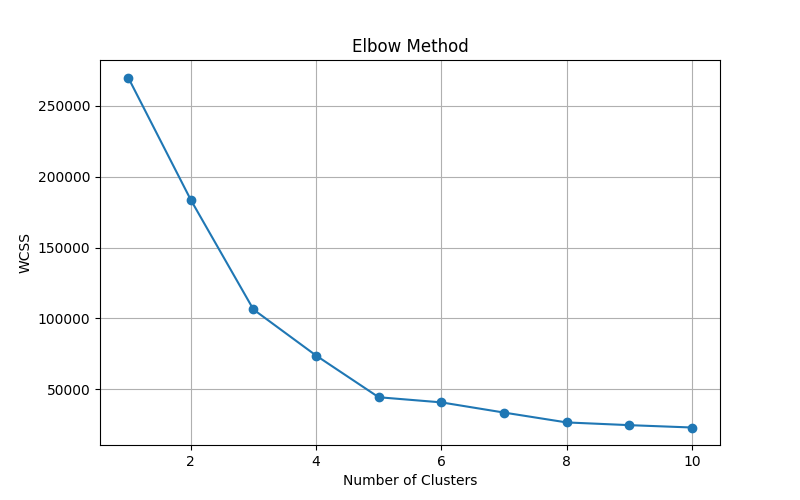
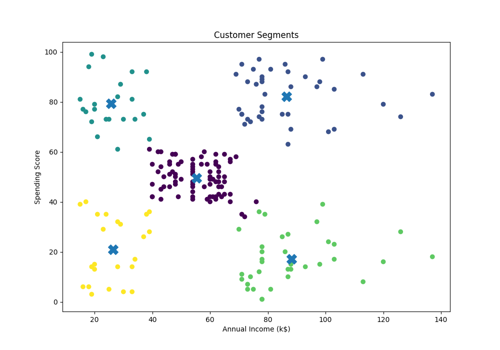

# Customer Segmentation & Recommendation System

# Project Overview

This project uses K-Means Clustering to segment customers based on their Annual Income and Spending Score. The system groups customers into different clusters and provides personalized product recommendations for each customer segment.
This project was developed as part of the Decode Lab Internship Program.

# Dataset

Mall Customer Dataset
Total Records: 200 Customers

Features Used:
- Annual Income (k$)
- Spending Score (1-100)

# Technologies Used

- Python
- Pandas
- Matplotlib
- Scikit-Learn (KMeans)

# Project Workflow

## 1. Data Loading
- Load customer dataset
- Display dataset information
- Check dataset shape and columns
- Check missing values

## 2. Feature Selection
Selected features:
- Annual Income (k$)
- Spending Score (1-100)

## 3. Elbow Method
- Calculated WCSS values for different cluster counts
- Determined the optimal number of clusters using the Elbow Method

## 4. Customer Segmentation
- Applied K-Means Clustering
- Divided customers into 5 different clusters

## 5. Cluster Visualization
- Visualized customer groups using scatter plots
- Displayed cluster centroids

## 6. Recommendation System
- Generated product recommendations for each customer segment.

## 7. User Prediction
Allows users to enter:
- Annual Income
- Spending Score
The system predicts the customer's cluster and recommends suitable products.

# Customer Recommendations

| Cluster | Recommendation |
|----------|----------------|
| 0 | Popular Products, Loyalty Rewards |
| 1 | Luxury Products, VIP Membership |
| 2 | Trending Products, Special Promotions |
| 3 | Personalized Marketing, Premium Product Bundles |
| 4 | Discount Coupons, Budget-Friendly Products |

# Project Structure
Customer-Segmentation-Recommendation-System/
```
├── data/
│   └── customers.csv
├── src/
│   └── customer_segmentation.py
├── elbow_method.png
├── customer_clusters.png
├── requirements.txt
├── .gitignore
└── README.md
```

# Elbow Method Graph



## Customer Segmentation Graph



# Sample User Input

Enter Annual Income (k$): 80
Enter Spending Score (1-100): 15

# Output

Customer belongs to Cluster 3

Recommended Items:
Personalized Marketing, Premium Product Bundles

# Results

- Successfully segmented customers into 5 groups
- Generated personalized recommendations
- Implemented user-based cluster prediction
- Visualized customer behavior using clustering techniques

## How to Run

1. Clone the repository
git clone <repository-link>

2. Install dependencies
pip install -r requirements.txt

3. Run the project
python src/customer_segmentation.py
